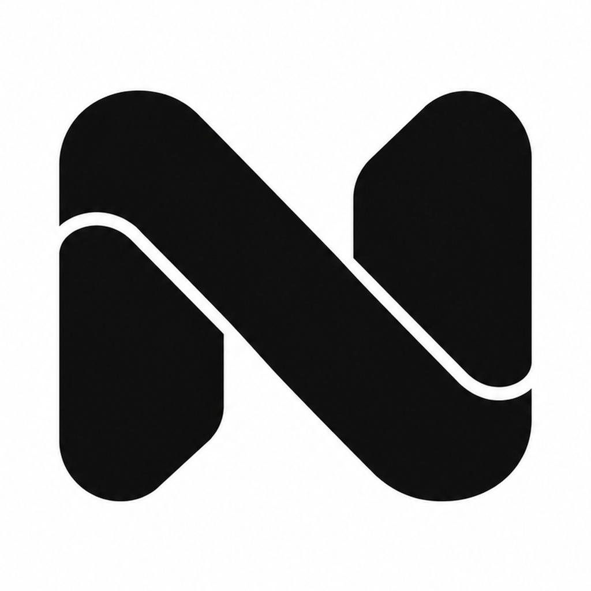
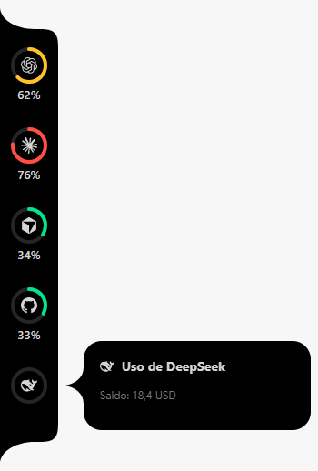
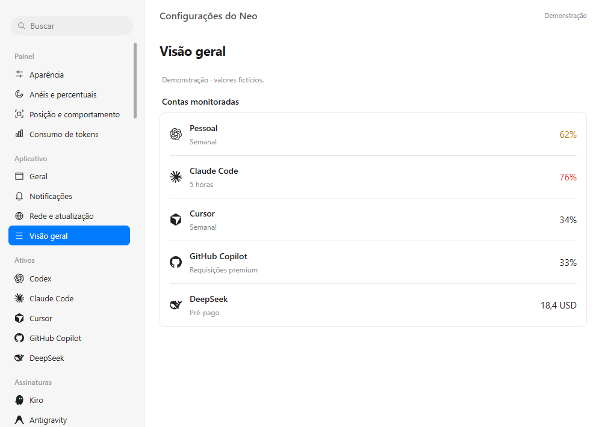
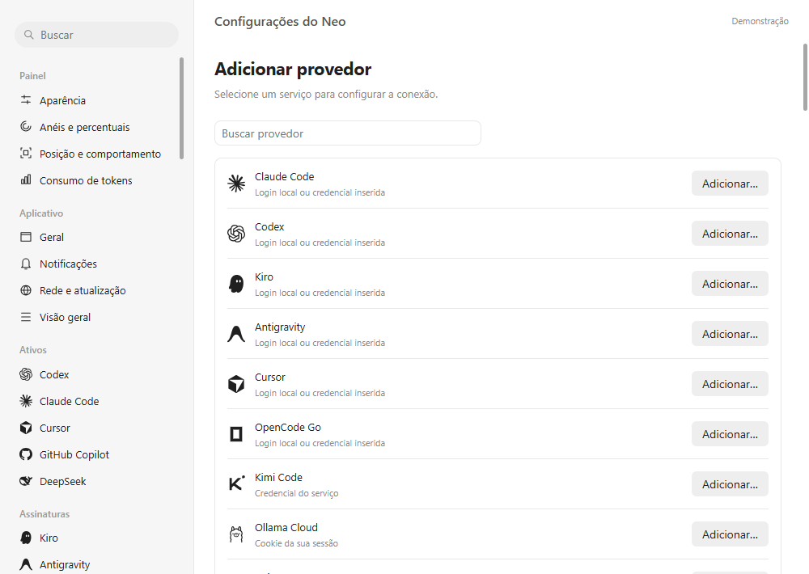
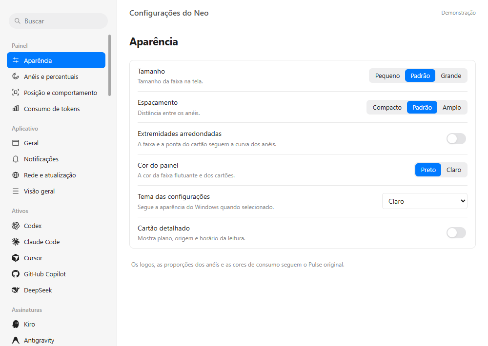
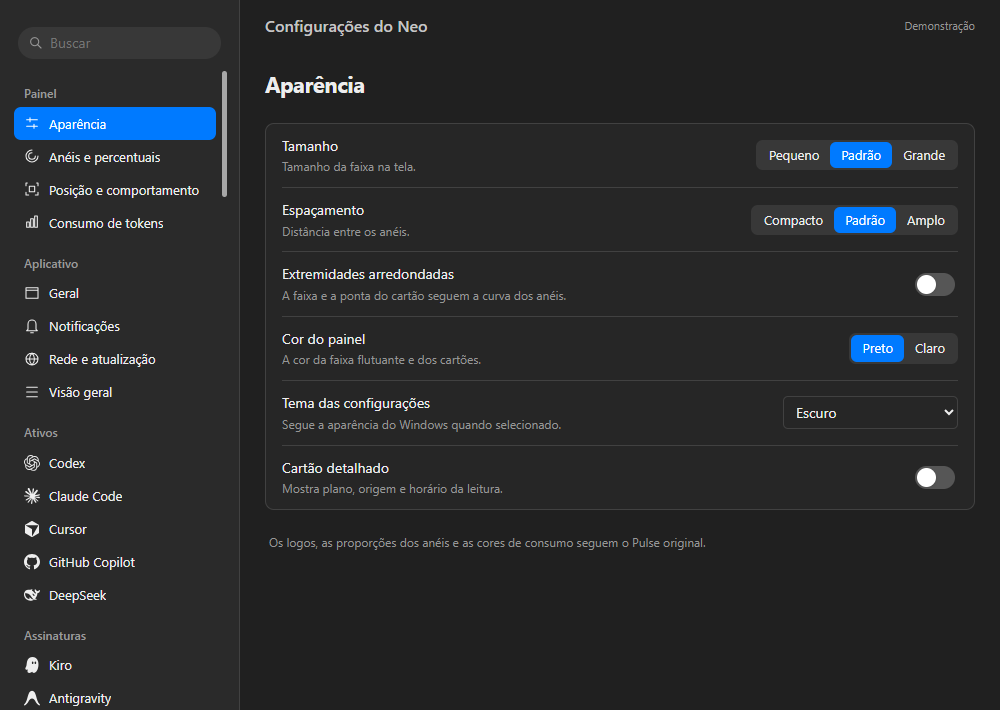
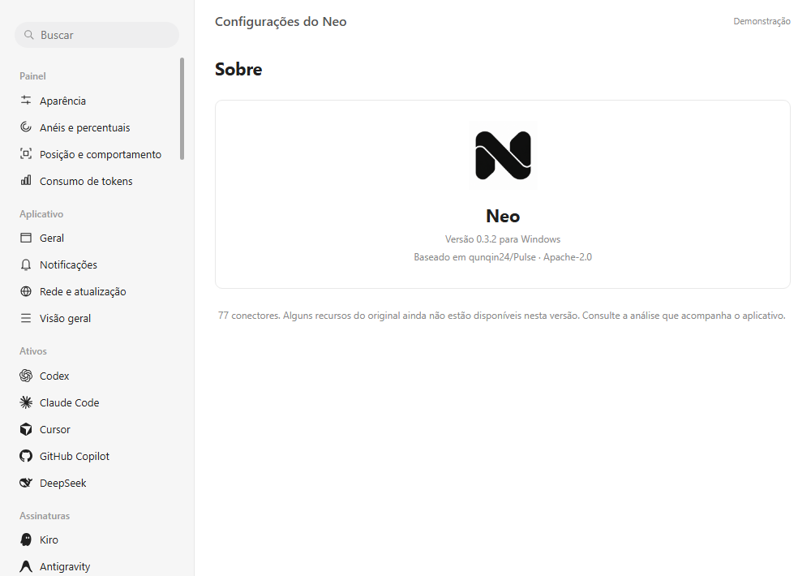

<p align="center">
  
</p>

<h1 align="center">Neo</h1>

<p align="center"><strong>Suas cotas de IA, na lateral do Windows.</strong></p>
<p align="center">Acompanhe consumo, saldo e renovação de várias contas em uma faixa discreta, com acesso pela bandeja.</p>

<p align="center">
  <a href="https://github.com/llypeDev/NEO/releases/latest"></a>
  
  
  <a href="LICENSE"></a>
  <a href="https://github.com/llypeDev/NEO/actions/workflows/ci.yml"></a>
</p>

<p align="center">
  <a href="https://github.com/llypeDev/NEO/releases/latest"><strong>Baixar para Windows</strong></a> ·
  <a href="#primeiros-passos">Primeiros passos</a> ·
  <a href="docs/CONFIGURACAO.md">Configurar provedores</a> ·
  <a href="https://github.com/llypeDev/NEO/issues">Reportar problema</a>
</p>

<p align="center"></p>
<p align="center"><sub>Demonstração com dados fictícios. Os valores reais dependem do serviço e da sua conta.</sub></p>

O **Neo** é uma adaptação independente do [Pulse](https://github.com/qunqin24/Pulse), de **qunqin24**, para Windows. A interface está em português brasileiro e reúne várias contas em um só lugar, sem um servidor próprio do Neo.

> [!NOTE]
> A versão **0.3.2** tem adaptadores para os 77 provedores do catálogo analisado. Isso indica código implementado, não autenticação comprovada em todos os serviços. A disponibilidade depende do plano, da credencial e dos endpoints do provedor. Consulte a [cobertura completa](PROVEDORES.md) e o [estado atual](#estado-atual).

## O que você pode fazer

| Recurso | Como funciona |
| --- | --- |
| **Cotas em um só lugar** | Acompanhe diferentes contas, limites por modelo, saldos e datas de renovação quando o provedor informar esses dados. |
| **Faixa nas quatro bordas** | Escolha direita, esquerda, topo ou rodapé; arraste para deixar a faixa flutuante ou encaixá-la novamente. |
| **Abertura animada** | A faixa aparece ao passar o mouse, abre cartões de conta e respeita o movimento reduzido do Windows. |
| **Aparência ajustável** | Tema claro, escuro ou do sistema; tamanho, espaçamento, percentuais usados ou restantes e segundo limite. |
| **Atualização periódica** | Consulte a cada 2–30 minutos ou atualize manualmente. Leituras antigas recebem indicação explícita. |
| **Bandeja e atalhos** | Abra as configurações, mostre ou oculte a faixa e configure atalhos e início com o Windows. |
| **Avisos opcionais** | Receba notificações de consumo, esgotamento, renovação e falhas repetidas. |
| **Histórico local** | Leia contadores de tokens do Codex e Claude Code por dia e modelo, quando essa opção estiver habilitada. |
| **Extensões e exportação** | Importe dados de um coletor próprio por JSON e exporte as leituras sem credenciais. |

<p align="center"></p>

## Baixar e instalar

**Requisitos:** Windows 10 ou 11 de 64 bits. Para consultar um serviço online, você precisa de conexão à internet e de uma conta com acesso ao produto correspondente. Você **não precisa instalar Node.js** para usar os executáveis.

Escolha um arquivo na página de [Releases](https://github.com/llypeDev/NEO/releases/latest):

| Arquivo da versão 0.3.2 | Indicado para |
| --- | --- |
| [Neo-0.3.2-x64-nsis.exe](https://github.com/llypeDev/NEO/releases/download/v0.3.2/Neo-0.3.2-x64-nsis.exe) | **Instalação normal:** assistente de instalação, atalho e opção de desinstalar pelo Windows. |
| [Neo-0.3.2-x64-portable.exe](https://github.com/llypeDev/NEO/releases/download/v0.3.2/Neo-0.3.2-x64-portable.exe) | **Uso portátil:** salve em uma pasta permanente e execute, sem instalação. As preferências ainda ficam no perfil do Windows. |
| [Neo-0.3.2-codigo.zip](https://github.com/llypeDev/NEO/releases/download/v0.3.2/Neo-0.3.2-codigo.zip) | **Desenvolvimento:** código, testes, documentação e imagens; não é o aplicativo pronto. |
| [SHA256SUMS.txt](https://github.com/llypeDev/NEO/releases/download/v0.3.2/SHA256SUMS.txt) | Conferir a integridade dos arquivos baixados. |

1. Baixe o instalador ou o executável portátil na lista **Assets** da release. O ZIP do botão **Code** do GitHub, assim como o `Neo-0.3.2-codigo.zip`, contém só o código-fonte, sem o aplicativo.
2. Execute o arquivo. No instalador, escolha a pasta e conclua o assistente.
3. Abra **Neo** e adicione seu primeiro provedor.

### Conferir o arquivo baixado

Os executáveis não têm assinatura digital. Se o Windows apresentar uma identificação de editor desconhecido, confira a origem do arquivo e seu hash antes de decidir executá-lo:

1. Abra o PowerShell e entre na pasta em que o arquivo foi salvo, normalmente Downloads.
2. Confira o nome do arquivo com `Get-ChildItem Neo-*.exe`. Se nada aparecer, o download não está nessa pasta. O navegador pode ter salvo o arquivo em outro lugar ou acrescentado " (1)" ao nome.
3. Copie o hash do arquivo nas notas da release ou na linha correspondente do [SHA256SUMS.txt](https://github.com/llypeDev/NEO/releases/download/v0.3.2/SHA256SUMS.txt).
4. Rode o comando abaixo colando o hash entre as aspas. Use o nome que o `Get-ChildItem` mostrou. O resultado deve ser `True`.

```powershell
cd $env:USERPROFILE\Downloads
Get-ChildItem Neo-*.exe
(Get-FileHash .\Neo-0.3.2-x64-portable.exe -Algorithm SHA256).Hash -eq 'cole-aqui-o-hash'
```

Um `False` sem mensagem de erro indica um arquivo diferente do publicado: apague-o e baixe de novo pela página de Releases. Se antes do `False` aparecer "Não é possível localizar o caminho", o arquivo não foi encontrado com esse nome nessa pasta, e o resultado não diz nada sobre a integridade.

## Primeiros passos

1. Na lista lateral, procure o nome do serviço ou abra **Adicionar provedor**.
2. Clique em **Adicionar…** e dê um nome à conta, por exemplo, “Pessoal” ou “Trabalho”.
3. Configure o login local, a chave, o token, o Cookie ou o arquivo exigido pelo serviço. Veja o [guia de configuração](docs/CONFIGURACAO.md).
4. Mantenha **Monitorar esta conta** habilitado e clique em **Salvar conexão**.
5. Em **Rede e atualização**, clique em **Atualizar**. Confira o resultado na página da conta ou em **Visão geral**.
6. Em **Posição e comportamento**, escolha a borda e o monitor. Passe o mouse na faixa recolhida para abri-la.

Nenhum provedor vem conectado por padrão. Você pode adicionar mais de uma conta do mesmo serviço e pausar uma conta sem excluí-la. Uma credencial já salva é mantida quando o campo fica vazio; use **Remover a credencial salva** para apagá-la.

**Exemplo com Codex:** autentique o cliente Codex no computador, adicione Codex no Neo e deixe habilitado **Usar login local quando nenhuma credencial for inserida**. O Neo lê o login existente; não abre um fluxo próprio de autenticação nem renova o token.

## Configurar os provedores

O catálogo contém **77 provedores**, incluindo Codex, Claude Code, Cursor, GitHub Copilot, Kimi Code, DeepSeek, Gemini, Kiro, Antigravity, Windsurf, JetBrains AI e gateways. A **Extensão local** é uma opção adicional.

| Tipo de conexão | O que você precisa |
| --- | --- |
| **Login local** | O cliente correspondente já autenticado no computador e a opção de login local habilitada no Neo. |
| **Chave ou token** | Credencial do produto específico. Uma chave de API pode não dar acesso à cota de uma assinatura do mesmo fornecedor. |
| **Cookie de sessão** | Cookie da sua própria sessão, inserido manualmente. O Neo não captura cookies automaticamente dos navegadores. |
| **Credencial em JSON** | Campos exigidos pelo serviço, como os dados de sessão do Windsurf ou Devin. |
| **CLI ou servidor local** | Ferramenta autenticada instalada no `PATH` ou aplicativo local aberto, conforme o conector. |
| **Gateway** | Endereço do seu servidor e a credencial correspondente. HTTPS é exigido; HTTP é permitido apenas em loopback local. |
| **Resposta JSON local** | Arquivo no formato aceito pelo parser do provedor. Substitui a consulta de rede para essa conta. |

Veja o [guia com instruções por tipo de serviço](docs/CONFIGURACAO.md) e a [lista dos 77 conectores com suas fontes](PROVEDORES.md). Os arquivos de [fixtures](test/fixtures) ajudam desenvolvedores a identificar os formatos aceitos.

<details>
<summary><strong>Ver o catálogo na interface</strong></summary>



</details>

## Usar e personalizar a faixa

- **Mostrar a faixa:** passe o mouse na borda escolhida. Desative **Ocultar até apontar** se quiser mantê-la expandida.
- **Ver uma conta:** aponte para o ícone para abrir seu cartão de uso.
- **Mover:** arraste com o botão esquerdo. Ao soltar perto de uma borda, a faixa volta a se encaixar.
- **Mudar de tela:** selecione o monitor em **Posição e comportamento**.
- **Alterar o visual:** ajuste **Aparência** e **Anéis e percentuais**. As preferências são salvas ao mudar os controles.
- **Escolher a métrica:** o limite principal é o mais próximo de esgotar, ou o limite fixado na configuração da conta. Você pode mostrar consumo ou percentual restante.
- **Receber avisos:** habilite **Notificações** e escolha o percentual para o alerta.
- **Criar atalhos:** em **Geral**, defina os atalhos de mostrar/ocultar a faixa e abrir as configurações. Eles começam desativados.

Um serviço que fornece apenas **saldo** pode não ter anel percentual. O Neo mostra somente as métricas disponíveis. A previsão de esgotamento é opcional e aparece como estimativa baseada em leituras da mesma janela.

O aplicativo continua na **bandeja** ao fechar a janela de configurações. Clique com o botão direito no ícone para abrir o painel, atualizar as cotas, mostrar/ocultar a faixa ou **Sair**.

<details>
<summary><strong>Ver as opções de aparência e a nova identidade</strong></summary>







</details>

## Privacidade e armazenamento

O Neo não tem backend próprio. Ele consulta os serviços das contas habilitadas e, quando solicitado, as páginas públicas de status de Codex, Claude e DeepSeek. O monitor não envia mensagens aos modelos para iniciar ou renovar janelas de uso.

Os dados ficam em `%APPDATA%\Pulse Windows`. O nome anterior é mantido para preservar as contas após a mudança de marca para Neo.

| Arquivo | Conteúdo |
| --- | --- |
| `settings.json` | Preferências, contas configuradas e caminhos locais. |
| `cache.json` | Últimas leituras de consumo e saldo. |
| `secrets.json` | Credenciais inseridas, protegidas pela criptografia do Windows via Electron `safeStorage`/DPAPI. |

As credenciais salvas não são devolvidas à interface nem incluídas na exportação de leituras. A proteção DPAPI depende da conta Windows; ela não impede acesso por outros programas executados pelo mesmo usuário. Os dados exportados ainda podem conter nomes de contas e métricas de uso: revise-os antes de compartilhar.

O histórico de tokens é lido somente após habilitar **Permitir leitura dos registros** e clicar em **Ler registros**. Os registros dos clientes monitorados não são alterados. O modo de demonstração usa valores fictícios e um diretório separado.

## Atualizar o Neo

Não há atualização automática nesta versão. Baixe a nova versão em [Releases](https://github.com/llypeDev/NEO/releases), encerre o Neo pelo menu da bandeja e execute o novo instalador ou portátil. As contas permanecem no mesmo perfil do Windows.

Para quem compila o código, **Abrir-Neo.cmd** seleciona o portátil mais recente em `release/` e reinicia uma versão anterior aberta pela mesma pasta. Mantenha **Abrir-Neo.ps1** ao lado do arquivo `.cmd`. O mesmo iniciador também aceita a estrutura de entrega anterior, com `Neo/release/`.

## Solução de problemas

| Situação | O que verificar |
| --- | --- |
| **A faixa não aparece** | Adicione e habilite uma conta, confira o monitor e a borda escolhidos e use **Mostrar faixa flutuante** na bandeja. |
| **A faixa parece uma pequena linha na borda** | Isso é o modo recolhido. Passe o mouse sobre ela ou desative **Ocultar até apontar**. |
| **A consulta retorna 401/403** | Verifique se o login expirou, se o token pertence ao produto correto e se o plano permite consultar essa métrica. Para login local, autentique novamente o cliente correspondente. |
| **Não há percentual, só saldo** | Alguns serviços informam saldo em dinheiro ou créditos sem uma cota percentual. |
| **Aparece uma leitura antiga** | Atualize a conta. Para um JSON local, atualize também o arquivo; ele recebe a data de sua última modificação e fica antigo após dez minutos. |
| **Abre uma versão antiga** | Encerre o Neo pela bandeja e abra o executável novo. Em uma pasta com versões compiladas, use **Abrir-Neo.cmd**. |
| **O atalho não funciona** | Escolha outra combinação em **Geral**; outro aplicativo pode estar usando o mesmo atalho. |
| **A credencial deixou de funcionar em outro PC** | Cadastre-a novamente. O arquivo protegido não é uma credencial portátil entre usuários ou computadores. |

Se o problema continuar, [abra uma issue](https://github.com/llypeDev/NEO/issues) com a versão do Neo, a versão do Windows, o provedor e a mensagem de erro. Remova tokens, Cookies, dados pessoais e identificadores de conta das capturas e dos arquivos anexados.

## Rodar a partir do código

Você precisa de **Node.js 24+**, npm, Git e Windows para executar o aplicativo e gerar os pacotes Windows. As versões de Electron e electron-builder estão fixadas no `package-lock.json`.

```powershell
git clone https://github.com/llypeDev/NEO.git
cd NEO
npm.cmd ci
npm.cmd start
```

Para explorar o visual sem conectar contas:

```powershell
npm.cmd run demo
```

### Comandos disponíveis

| Comando | Função |
| --- | --- |
| `npm.cmd start` | Abre o aplicativo usando o perfil normal. |
| `npm.cmd run demo` | Abre uma demonstração com contas e valores fictícios. |
| `npm.cmd run smoke` | Verifica a interface em modo de demonstração e salva capturas no perfil de teste. |
| `npm.cmd test` | Executa os testes de parsers, cache, contratos e geometrias. |
| `npm.cmd run check` | Confere a sintaxe e a presença dos adaptadores do catálogo. |
| `npm.cmd run json` | Exporta o cache local pelo terminal, sem iniciar Electron ou consultar a rede. |
| `npm.cmd run pack` | Gera a aplicação descompactada em `release/win-unpacked/`. |
| `npm.cmd run build` | Gera instalador NSIS e executável portátil x64 em `release/`. |

Os pacotes e `node_modules/` não entram no Git. Os binários prontos são distribuídos em Releases.

### Usar um perfil isolado

Para testar sem usar as contas do seu perfil normal, defina `PULSE_WINDOWS_DATA` antes de iniciar o aplicativo:

```powershell
$env:PULSE_WINDOWS_DATA = Join-Path $PWD '.neo-dev-data'
npm.cmd start
# Depois de fechar o aplicativo:
Remove-Item Env:PULSE_WINDOWS_DATA
```

### Estrutura do projeto

```text
src/
  main.cjs              Janelas, bandeja, consultas e comunicação com a interface
  preload.cjs           Interface controlada entre Electron e o renderer
  registry.cjs          Catálogo e opções de conexão
  providers.cjs         Autenticação e leitura dos serviços
  profiles.cjs          Contratos de requisição e interpretação das respostas
  special.cjs           Integrações específicas, CLIs e servidores locais
  core.cjs              Normalização de uso, cache, avisos e estimativas
  storage.cjs           Preferências e proteção de credenciais
  ledger.cjs            Histórico local de tokens
  panel-layout.cjs      Posicionamento da faixa e dos cartões
  dock-geometry.cjs     Curvas e geometria de encaixe na borda
  ui/                   Interface, estilos e animações
assets/                 Logo e recursos dos provedores
test/                   Testes e fixtures
docs/                   Guia de configuração e imagens
```

Veja [CONTRIBUTING.md](CONTRIBUTING.md) para colaborar e [DESIGN.md](DESIGN.md) para as referências de forma e animação.

## Extensão por JSON

Na seção **Extensões**, selecione um arquivo que seu próprio coletor atualiza. O Neo lê o JSON; não executa o coletor. Exemplo com uma cota sem horário de renovação informado:

```json
{
  "plan": "Plano da equipe",
  "windows": [
    {
      "id": "daily",
      "label": "Diário",
      "usedPercent": 42,
      "resetsAt": null,
      "windowSeconds": 86400,
      "exhausted": false
    }
  ],
  "balances": []
}
```

Quando houver uma data real de renovação, use uma string ISO 8601 em `resetsAt`. Atualize o arquivo conforme as novas leituras, pois sua data de modificação é usada para indicar a idade dos dados. Uma resposta importada de um provedor específico precisa seguir o formato daquele parser, e não necessariamente o formato da extensão acima.

## Estado atual

O Neo 0.3.2 oferece o catálogo de 77 conectores e os recursos de interface descritos neste README. A validação local inclui **106 testes automatizados** e **24 verificações do executável portátil no Windows**, incluindo sandbox das janelas, catálogo, comunicação, criptografia de credenciais, geometrias e animação. Os testes de provedores usam fixtures e simulações; não comprovam o acesso real aos 77 serviços.

Ainda estão pendentes:

- Fluxos próprios de login OAuth e renovação de tokens.
- Importação automática de Cookies dos navegadores.
- Leitores de histórico além de Codex e Claude Code; o original tem um catálogo de 54 fontes.
- Precificação de modelos, recaps, mascotes e histórico de 90 dias das páginas de status.
- Atualizações automáticas e assinatura digital dos pacotes.
- Validação com contas reais de todo o catálogo e cobertura física de várias telas e escalas.

O visual foi adaptado das formas e animações do Pulse. Recursos específicos do macOS, como Liquid Glass e a geometria de notch, não estão disponíveis nesta implementação. Endpoints privados podem mudar e exigir manutenção. O [histórico de versões](CHANGELOG.md) registra as mudanças já entregues.

## Créditos e licença

Projeto publicado por [llypeDev](https://github.com/llypeDev), baseado no [Pulse de qunqin24](https://github.com/qunqin24/Pulse), revisão `73e210f10fc98b5e097fd0ee8c021f9965327ebe`. A logo N em fita preta compõe a identidade do Neo. As marcas dos provedores identificam os respectivos serviços; não implicam endosso.

O código é distribuído sob a [licença Apache-2.0](LICENSE). As atribuições do original, das fixtures e dos recursos adaptados estão preservadas em [NOTICE](NOTICE). O Neo é uma adaptação independente para Windows.
